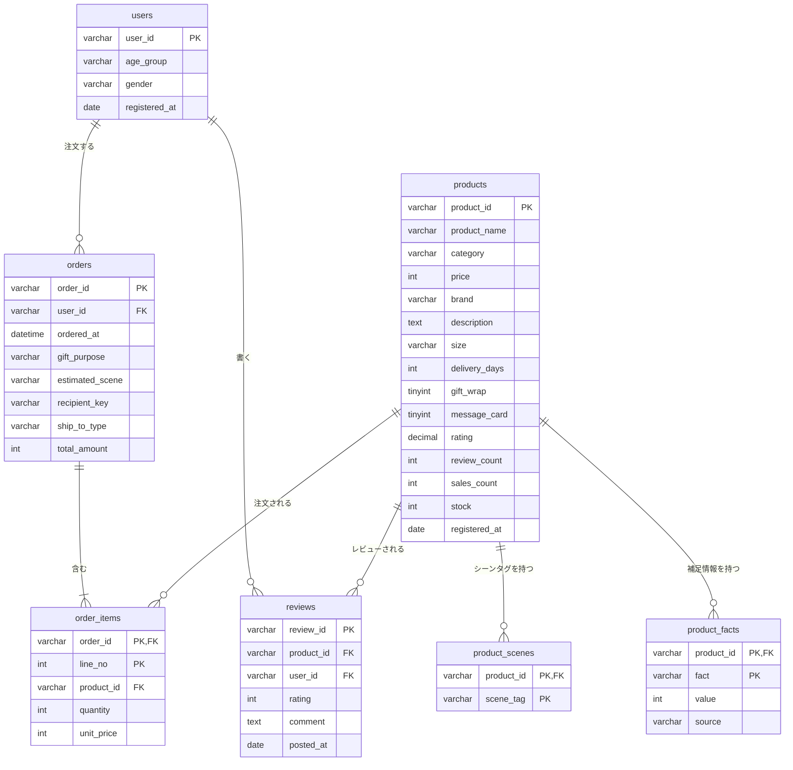

# ER 図（班の DB：giftia_t104）

テーブルの項目とつながりの正（最新版）は、このファイルです。
テーブルや項目を変えたときは、このファイルも同じ PR で直してください。

```mermaid
erDiagram
    users ||--o{ orders : "注文する"
    users ||--o{ reviews : "書く"
    orders ||--|{ order_items : "含む"
    products ||--o{ order_items : "注文される"
    products ||--o{ reviews : "レビューされる"
    products ||--o{ product_scenes : "シーンタグを持つ"
    products ||--o{ product_facts : "補足情報を持つ"

    users {
        varchar user_id PK
        varchar age_group
        varchar gender
        date registered_at
    }

    orders {
        varchar order_id PK
        varchar user_id FK
        datetime ordered_at
        varchar gift_purpose
        varchar estimated_scene
        varchar recipient_key
        varchar ship_to_type
        int total_amount
    }

    order_items {
        varchar order_id PK, FK
        int line_no PK
        varchar product_id FK
        int quantity
        int unit_price
    }

    products {
        varchar product_id PK
        varchar product_name
        varchar category
        int price
        varchar brand
        text description
        varchar size
        int delivery_days
        tinyint gift_wrap
        tinyint message_card
        decimal rating
        int review_count
        int sales_count
        int stock
        date registered_at
    }

    product_scenes {
        varchar product_id PK, FK
        varchar scene_tag PK
    }

    product_facts {
        varchar product_id PK, FK
        varchar fact PK
        int value
        varchar source
    }

    reviews {
        varchar review_id PK
        varchar product_id FK
        varchar user_id FK
        int rating
        text comment
        date posted_at
    }
```

## 補足

- `product_facts` は、配布の ER 図（データ定義.md）には載っていませんが、班の DB にあるテーブルです。
